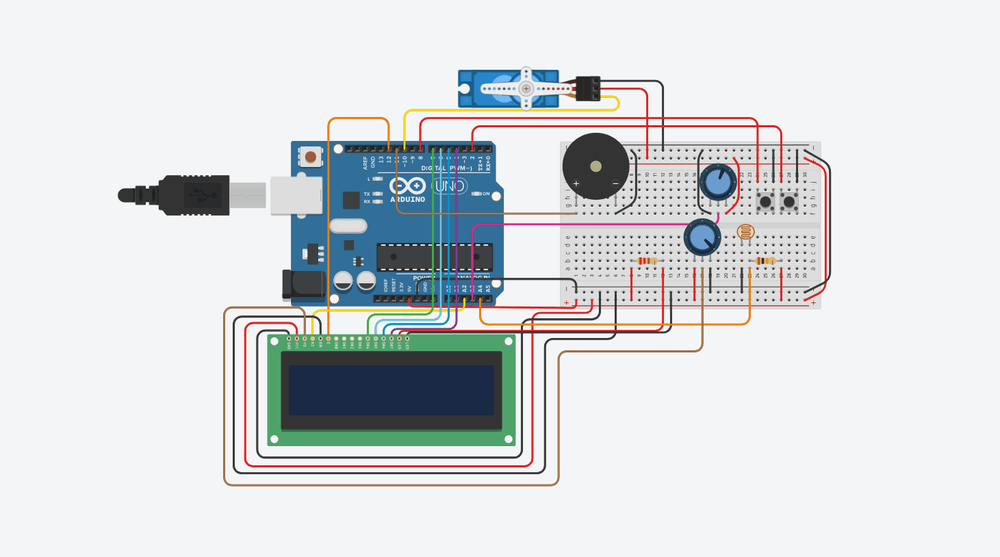

# PROJETO IOT: COFRE INTELIGENTE 

## 👨‍💻 Integrantes

* Érik Ordine — RA: 22.224.021-0
* Guilherme Rocha — RA: 22.124.061-7

---

## 🎯 1. Objetivo
Desenvolver um cofre inteligente utilizando os conceitos aprendidos em sala de aula durante o semestre, sendo eles:

* Integração de múltiplos periféricos;
* Aplicação de interrupção externa;
* Manipulação de sinais analógicos e digitais;
* Desenvolvimento de interfaces com LCD;
* Implementação de lógica de estados.

---

## 🛠️ 2. Componentes
* 1x Microcontrolador Arduino Uno R3
* 1x Cabo de Comunicação e Alimentação USB A-B
* 1x Protoboard (Placa de Ensaio) de tamanho padrão (830 pontos)
* 1x Display LCD 16x2
* 1x Micro Servo Motor
* 1x Buzzer Piezoelétrico
* 2x Potenciômetros Lineares de 10K Ohms
* 1x Sensor de Luz LDR (Fotorresistor)
* 2x Botões
* 1x Resistor de 10kΩ (Marrom, Preto, Laranja)
* 1x Resistor de 220 Ohms (Vermelho, Vermelho, Marrom)
* Kit de Cabos Jumper de cores variadas para conexões

---

## 📄 3. Documentação Completa

Para acessar a documentação completa do projeto, consulte os seguintes arquivos:

* [Relatório técnico](documentacao/relatorio_tecnico.pdf)
* [Diagrama de conexões](documentacao/diagrama_conexoes.pdf)
* [Montagem no Tinkercad](documentacao/montagem_tinkercad.png)
